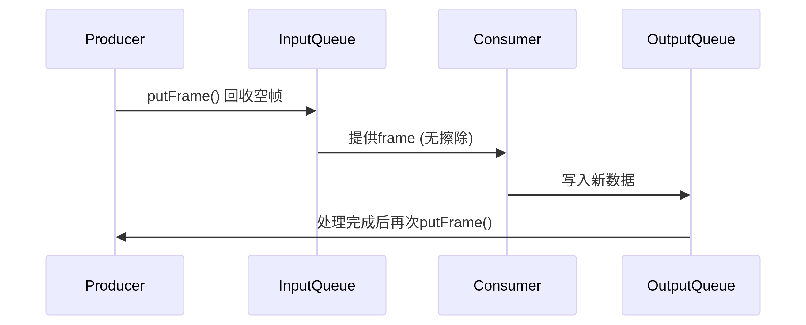

> 在 MediaSource::putFrame(AVFrame* frame) 方法中，不需要显式擦除 AVFrame 的数据，这是由设计模式决定的。以下是详细解释：

### 1. 双队列内存管理机制
   * 该代码属于典型的内存池模式，AVFrame 的数据生命周期由队列系统自动管理：
```c
mAVFrameInputQueue.push(frame); // 将frame回收到输入队列
```
* 输入队列 (mAVFrameInputQueue)：存放可复用的空帧容器
* 输出队列 (mAVFrameOutputQueue)：存放已填充数据的帧

### 2. 为什么不需要擦除？
   * 设计逻辑：
   1. 写入时覆盖
   * 当该帧下次被 readFrame() 取出使用时，会直接覆盖原有数据：
```c
frame->mFrameSize = getFrameFromH264File(...); // 新数据覆盖旧数据
```
2. 数据有效性保障

* 消费者从输出队列取帧后，处理完毕会调用 putFrame() 将帧归还到输入队列
* 帧的 mFrameSize 在下次读取时会被更新，旧数据自然失效

3. 性能优化
* 避免不必要的内存擦除操作（节省CPU周期）

### 3. 对比需要擦除的场景
   如果出现以下情况才需要主动擦除：

| 场景|	处理方式|
|:--------|:--------------:|
|帧内含敏感数据	|memset(frame->mBuffer, 0, FRAME_MAX_SIZE)|
|调试时检查空帧	|填充特殊标记（如 0xDEADBEEF）|
|内存泄漏检测	|在释放时验证数据|
### 4. frame 使用流程
   
### 5. 线程安全考虑
   * MutexLockGuard 已保证队列操作的原子性

* 如果擦除数据，反而可能引发问题：

```c
// 错误示例（可能破坏正在使用的帧）：
void putFrame(AVFrame* frame) {
    memset(frame->mBuffer, 0, ...); // 危险！其他线程可能正在读取
    mAVFrameInputQueue.push(frame);
}
```
### 6. 调试
* 如需调试：可添加状态标记
```c
struct AVFrame {
enum { FREE, IN_USE } state;
// ...
};

void putFrame(AVFrame* frame) {
    frame->state = AVFrame::FREE; // 仅标记，不擦数据
// ...
}
```
> 性能敏感场景：建议使用内存池分配器（如 boost::pool）

### 总结
* 该代码不需要擦除 AVFrame 数据，因为：
* 覆盖写入的设计消除了旧数据影响
* 双队列机制保证了内存安全复用
* 避免冗余操作提升了性能
* 这种模式常见于视频处理（如FFmpeg）、游戏引擎等高性能系统中。

